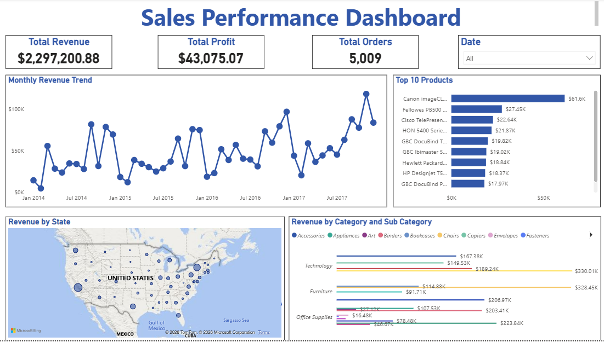

# \## Sales Pipeline Project 

## Overview
An end-to-end data engineering pipeline that ingests raw sales data, transforms it using dbt, stores it in Snowflake, and visualises insights in Power BI.

## Architecture
Raw CSV → Python → Snowflake → dbt → Power BI

## Tools Used

- Python —> data ingestion and loading
- Snowflake —> cloud data warehouse
- dbt —> data transformation and modelling
- Power BI —> dashboard and visualisation
- Git/GitHub —> version control

## Data
Superstore Sales Dataset (9,994 rows) covering sales transactions from 2014–2017 across the United States.

Download the dataset free from Kaggle:
https://www.kaggle.com/datasets/vivek468/superstore-dataset-final

Once downloaded, rename the file to `Sample - Superstore.csv` and place it in the project's root.

Note: Raw data files are not stored in this repository, following data engineering best practices.

## dbt Models

 | Model | Description |

 |------------|-------------|

 | `monthly_revenue` | Monthly revenue, orders and average order value |

 | `sales_by_category` | Revenue and profit by product category |

 | `sales_by_region` | Revenue breakdown by region and state |

 | `top_products` | Top 10 products by total revenue |

## Dashboard Highlights

- $2.3M total revenue across 4 years

- 5,009 total orders

- Canon imageCLASS top product at $61.6K

- Technology category leads with $330K revenue

## Dashboard Preview

## How to Run

1. Clone the repo
2. Download the dataset from Kaggle (link above)
3. Rename it to `Sample - Superstore.csv` and place in the root folder
4. Create a `.env` file with your Snowflake credentials:
   - SNOWFLAKE_USER=your_username
   - SNOWFLAKE_PASSWORD=your_password
   - SNOWFLAKE_ACCOUNT=your_account
5. Run `pip install -r requirements.txt`
6. Run `python load_to_snowflake.py`
7. Run `dbt run` inside `sales_transforms`